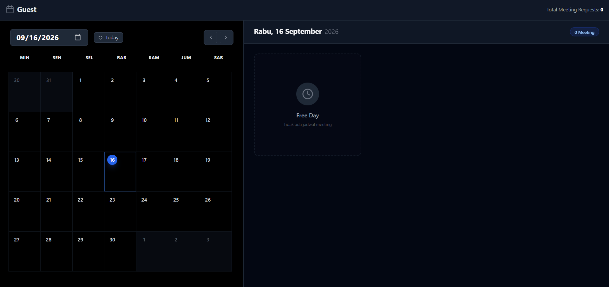
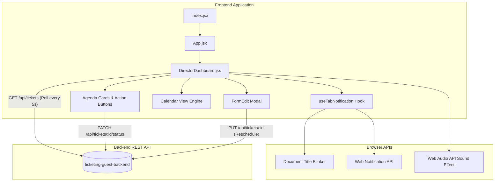

# 📅 Guest & Meeting Ticketing System - Executive Dashboard Frontend

[](https://react.dev/)
[](https://vitejs.dev/)
[](https://tailwindcss.com/)
[](https://lucide.dev/)
[](LICENSE)

A modern, high-performance **Executive Meeting & Guest Approval Dashboard** built with **React 19**, **Vite**, and **Tailwind CSS**. Designed specifically for directors and meeting hosts to monitor real-time visitor queues, approve or reject guest requests, manage schedules on an interactive calendar, and receive instant multi-sensory alerts.

---

## 📸 Preview & User Experience

---

## 🌟 Key Features & Engineering Highlights

- **⚡ Blazing Fast Build & Hot Reload**: Powered by **Vite 7** with ES modules and optimized compilation, ensuring sub-second startup and instantaneous HMR (Hot Module Replacement).
- **📆 Interactive Calendar Engine**:
  - Custom calendar grid computation using `date-fns` with Indonesian locale (`id`).
  - Month/year navigation with fast jump-to-today and date picker selector.
  - Visual density badges (Google Calendar style) showing meeting counts per day directly inside the grid cells.
- **🔔 Multi-Sensory Real-Time Notification System**:
  - **Custom Hook (`useTabNotification`)**: Dynamically blinks the browser tab title (`🔔 (N) New Request!`) when the tab is backgrounded.
  - **Native Web Notification API**: Dispatches system desktop push notifications so executives never miss a visitor arrival.
  - **Web Audio API**: Plays an auditory chime (`/notification.mp3`) on incoming queue increments.
  - **Auto-Sync Polling**: Background synchronization with the backend API every 5 seconds with live pulse indicator.
- **🎯 One-Click Meeting Workflow & Status Transitions**:
  - `Waiting` ➔ Quick **Approve** (moves guest to `In The Room`), **Reject**, or **Reschedule**.
  - `In The Room` ➔ Quick **Finish** to conclude session.
- **🛡️ Reschedule Modal with Client-Side Validation**:
  - Validates dates and times to prevent scheduling in past timestamps.
  - Handles timezone offset pitfalls using ISO 8601 formatting (`fr-CA` date string conversion).
  - Chip tags for participant rosters.
- **🎨 Premium Dark Theme & Split-Panel Ergonomics**:
  - Custom dark theme built with Tailwind CSS (`gray-900` to `gray-950`).
  - Master-Detail layout: Calendar navigation on the left (40%) and high-priority action agenda cards on the right (60%).

---

## 🏗️ Architecture & Component Flow



---

## 🛠️ Tech Stack & Libraries

| Technology | Version | Purpose & Architectural Decision |
| :--- | :--- | :--- |
| **React** | `^19.2.3` | Modern component UI library with declarative rendering and hooks |
| **Vite** | `^7.3.0` | Next-generation frontend tooling with lightning-fast builds |
| **Tailwind CSS** | `^3.4.17` | Utility-first styling for flexible, cohesive dark-mode design |
| **date-fns** | `^4.1.0` | Lightweight, immutable date manipulation with Indonesian locale support |
| **Lucide React** | `^0.555.0` | Clean, modern feather-based SVG icons |

---

## 📁 Project Structure

```text
ticketing-guest-frontend/
├── public/
│   ├── file (2).svg          # Application favicon & branding asset
│   └── notification.mp3      # Alert chime for incoming ticket requests
├── src/
│   ├── components/
│   │   └── FormEdit.jsx      # Modal component for reschedule & editing ticket details
│   ├── pages/
│   │   └── DirectorDashboard.jsx  # Main executive dashboard, calendar & queue handlers
│   ├── App.jsx               # Root layout wrapper
│   ├── index.css             # Tailwind base, components, and utilities
│   └── index.jsx             # React DOM root entry point
├── dist/                     # Optimized production bundle output
├── index.html                # HTML5 entry template with viewport & SEO meta
├── package.json              # Dependencies and build scripts
├── postcss.config.js         # PostCSS configuration for Tailwind
├── tailwind.config.js        # Tailwind custom utilities and content paths
└── vite.config.js            # Vite configuration with port and React plugin
```

---

## 🚀 Getting Started

### 1. Prerequisites
Ensure you have the following installed on your machine:
- [Node.js](https://nodejs.org/) (version `18.x` or higher recommended)
- [npm](https://www.npmjs.com/) or [yarn](https://yarnpkg.com/)
- The companion backend API running on `http://localhost:5000` ([ticketing-guest-backend](https://github.com/simonaditiabbp/ticketing-guest-backend))

### 2. Installation
Clone the repository and install dependencies:

```bash
# Clone the repository
git clone https://github.com/simonaditiabbp/ticketing-guest-frontend.git

# Navigate into project directory
cd ticketing-guest-frontend

# Install dependencies
npm install
```

### 3. Running Development Server
Start the Vite local development server:

```bash
npm run dev
```

The application will be accessible at:
```
http://localhost:3000
```

### 4. Production Build
To create an optimized production build:

```bash
npm run build
```

To preview the production build locally:

```bash
npm run preview
```

---

## 🔄 Interaction with Backend API

This frontend dashboard seamlessly integrates with the REST API provided by `ticketing-guest-backend`:

| Action | HTTP Method | Endpoint | Description |
| :--- | :--- | :--- | :--- |
| **Fetch Queue** | `GET` | `/api/tickets` | Synchronizes active meetings (`Waiting`, `In The Room`) |
| **Update Status** | `PATCH` | `/api/tickets/:id/status` | Updates meeting status to `In The Room`, `Reject`, or `Finished` |
| **Reschedule** | `PUT` | `/api/tickets/:id` | Modifies schedule date/time and updates participants |

---

## 💡 Engineering Highlights for Technical Reviewers

1. **Memory Leak Prevention in Polling**:
   Interval timers and event listeners (`visibilitychange`, `setInterval`) are strictly cleared inside `useEffect` cleanup return functions.
2. **Resilient Date Timezone Parsing**:
   Uses `toLocaleDateString('fr-CA')` and `date-fns` to guarantee date strings match `YYYY-MM-DD` accurately without unexpected UTC minus-one-day shifts.
3. **Optimistic & Safe Status Transitions**:
   Confirmation prompts guard status alterations, preventing accidental approvals or rejections during live meetings.

---

## 👤 Author & Connect

**Pilal**  
- **GitHub**: [@Pilalz](https://github.com/Pilalz)
- **Role**: Frontend / Full-Stack Developer  

---

<div align="center">
  <sub>Built with ❤️ using React 19 and Tailwind CSS</sub>
</div>
